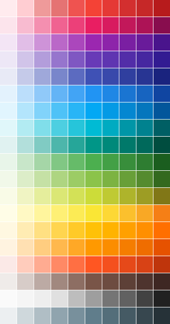

# Material Design Color Palette Generator

A reverse engineered library for generating a custom Material Design color palette. The original tool can be
seen [here](https://material.io/design/color/the-color-system.html#tools-for-picking-colors "Google's palette generation tool")



## Color Palette Generation

The algorithm to generate a Material Design color palette is entirely written in Kotlin and can be used in Android and
on the JVM. It is exactly the same as the algorithm that is used in [Google's palette generation tool](
https://material.io/design/color/the-color-system.html#tools-for-picking-colors "Google's palette generation tool").

## Usage

```kotlin
val customPalette: List<RgbColor> = "F44336".toRgbColorOrNull()!!.createPalette()
```

produces the following color palette:

<div style="display: table">
    <div style="display: table-row">
        <div title="#FFEBEE" style="display: table-cell; background: #FFEBEE; width: 50px; height: 50px"></div>
        <div title="#FFCDD2" style="display: table-cell; background: #FFCDD2; width: 50px; height: 50px"></div>
        <div title="#EF9A9A" style="display: table-cell; background: #EF9A9A; width: 50px; height: 50px"></div>
        <div title="#E57373" style="display: table-cell; background: #E57373; width: 50px; height: 50px"></div>
        <div title="#EF5350" style="display: table-cell; background: #EF5350; width: 50px; height: 50px"></div>
        <div title="#F44336" style="display: table-cell; background: #F44336; width: 50px; height: 50px"></div>
        <div title="#E53935" style="display: table-cell; background: #E53935; width: 50px; height: 50px"></div>
        <div title="#D32F2F" style="display: table-cell; background: #D32F2F; width: 50px; height: 50px"></div>
        <div title="#C62828" style="display: table-cell; background: #C62828; width: 50px; height: 50px"></div>
        <div title="#B71B1C" style="display: table-cell; background: #B71B1C; width: 50px; height: 50px"></div>
    </div>
    <div style="display: table-row">
        <div style="display: table-cell; text-align: center">50</div>
        <div style="display: table-cell; text-align: center">100</div>
        <div style="display: table-cell; text-align: center">200</div>
        <div style="display: table-cell; text-align: center">300</div>
        <div style="display: table-cell; text-align: center">400</div>
        <div style="display: table-cell; text-align: center">500</div>
        <div style="display: table-cell; text-align: center">600</div>
        <div style="display: table-cell; text-align: center">700</div>
        <div style="display: table-cell; text-align: center">800</div>
        <div style="display: table-cell; text-align: center">900</div>
    </div>
</div>

```kotlin
listOf(
    "FFEBEE",
    "FFCDD2",
    "EF9A9A",
    "E57373",
    "EF5350",
    "F44336",
    "E53935",
    "D32F2F",
    "C62828",
    "B71B1C"
)
```

### Gradle

Declare the dependency to this library in your gradle-project.

```kotlin
dependencies {
    implementation("de.hammwerk:material-color-palette:1.0.0")
}
```

## License
    MIT License

    Copyright (c) 2021 David Hamm
    
    Permission is hereby granted, free of charge, to any person obtaining a copy
    of this software and associated documentation files (the "Software"), to deal
    in the Software without restriction, including without limitation the rights
    to use, copy, modify, merge, publish, distribute, sublicense, and/or sell
    copies of the Software, and to permit persons to whom the Software is
    furnished to do so, subject to the following conditions:
    
    The above copyright notice and this permission notice shall be included in all
    copies or substantial portions of the Software.
    
    THE SOFTWARE IS PROVIDED "AS IS", WITHOUT WARRANTY OF ANY KIND, EXPRESS OR
    IMPLIED, INCLUDING BUT NOT LIMITED TO THE WARRANTIES OF MERCHANTABILITY,
    FITNESS FOR A PARTICULAR PURPOSE AND NONINFRINGEMENT. IN NO EVENT SHALL THE
    AUTHORS OR COPYRIGHT HOLDERS BE LIABLE FOR ANY CLAIM, DAMAGES OR OTHER
    LIABILITY, WHETHER IN AN ACTION OF CONTRACT, TORT OR OTHERWISE, ARISING FROM,
    OUT OF OR IN CONNECTION WITH THE SOFTWARE OR THE USE OR OTHER DEALINGS IN THE
    SOFTWARE.